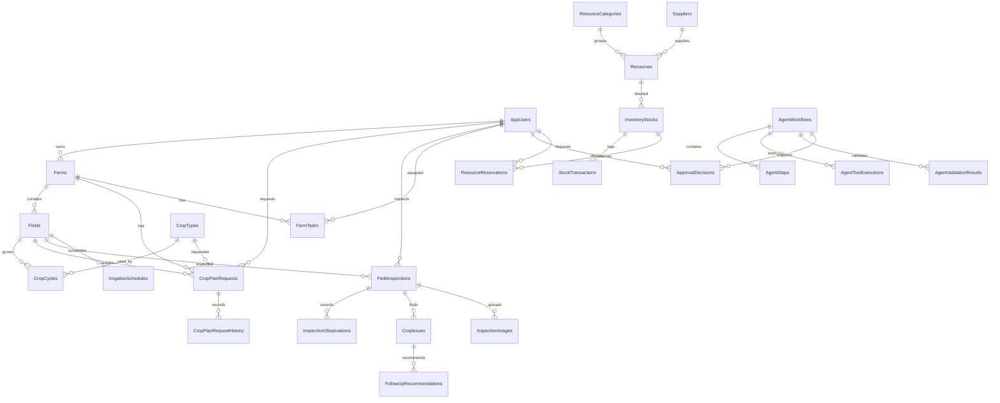

# ER Diagram

```mermaid
erDiagram
    AppUsers ||--o{ Farms : owns
    AppUsers ||--o{ CropPlanRequests : requests
    AppUsers ||--o{ FieldInspections : inspects
    AppUsers ||--o{ FarmTasks : assigned
    AppUsers ||--o{ ApprovalDecisions : decides
    AppUsers ||--o{ ResourceReservations : requests

    Farms ||--o{ Fields : contains
    Farms ||--o{ CropPlanRequests : has
    Farms ||--o{ FarmTasks : has
    Fields ||--o{ CropCycles : grows
    Fields ||--o{ CropPlanRequests : scopes
    Fields ||--o{ FieldInspections : inspected
    Fields ||--o{ IrrigationSchedules : schedules
    CropTypes ||--o{ CropCycles : used_by
    CropTypes ||--o{ CropPlanRequests : requested
    CropPlanRequests ||--o{ CropPlanRequestHistory : records

    FieldInspections ||--o{ InspectionObservations : records
    FieldInspections ||--o{ CropIssues : finds
    FieldInspections ||--o{ InspectionImages : uploads
    CropIssues ||--o{ FollowUpRecommendations : recommends

    ResourceCategories ||--o{ Resources : groups
    Suppliers ||--o{ Resources : supplies
    Resources ||--o{ InventoryStocks : stocked
    InventoryStocks ||--o{ StockTransactions : logs
    InventoryStocks ||--o{ ResourceReservations : reserves

    AgentWorkflows ||--o{ AgentSteps : contains
    AgentWorkflows ||--o{ AgentToolExecutions : executes
    AgentWorkflows ||--o{ AgentValidationResults : validates
    AgentWorkflows ||--o{ ApprovalDecisions : supports
```

The AgentWorkflow tables are present for later AI phases only. The current BASIC foundation does not execute AI workflows.