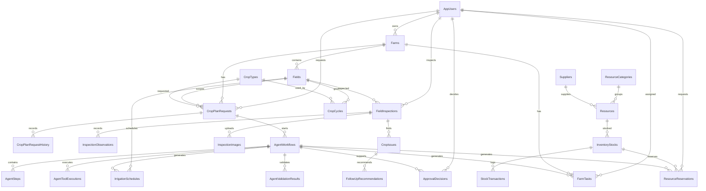

# ER Diagram

The workflow tables are active. `AgentStep` stores each agent's execution result, `AgentValidationResult` records candidate checks, and `ApprovalDecision` records the officer's decision. Final tasks, irrigation schedules, and reservations have nullable `GeneratedByWorkflowId` provenance and a candidate revision; they are created only after approval. The workflow-to-final-record relationships are optional because manual records also exist.
