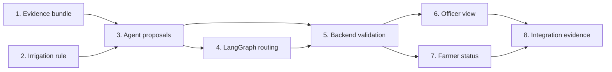

# Member 4 Explainable Scheduling Implementation Plan

**Progress on 2026-09-30:** The branch contains the evidence bundle, verified irrigation parser, deterministic three-node scheduler, version-2 backend guard, blocked status, officer/farmer views, and a three-decimal inventory migration. Local backend, AI, React, Flutter, and isolated PostgreSQL tests passed; exact counts are in `docs/testing/verification-log.md`. The checklist below remains the original work breakdown, not a claim that every named test or live acceptance scenario has run. A live HTTP ready/blocked demonstration and remote CI review remain.

> **For agentic workers:** REQUIRED SUB-SKILL: Use superpowers:subagent-driven-development (recommended) or superpowers:executing-plans to implement this plan task-by-task. Steps use checkbox (`- [ ]`) syntax for tracking.

**Goal:** Produce evidence-linked, reviewable pre-planting and crop-cycle proposals, with safe resource/irrigation handling and no final writes before officer approval.

**Architecture:** ASP.NET builds a typed evidence bundle from persisted Member 1-3 outputs and one verified crop profile. A multi-node LangGraph scheduler creates deterministic proposal-only items and source references; ASP.NET validates them independently, then the existing officer transaction rechecks mutable state before final writes. React shows reasons and sources; Flutter shows the new blocked status.

**Tech Stack:** ASP.NET Core 8, EF Core 8/PostgreSQL, FastAPI/Pydantic/LangGraph, React/TypeScript/Vite, Flutter, xUnit, pytest, Vitest.

**Spec:** `docs/superpowers/specs/2026-09-29-member4-explainable-scheduling-design.md`

## Global Constraints

- Start feature work from the latest clean `dev` on a focused Member 4 branch; preserve the current unrelated `.gitignore`, Flutter, and `ai-service/pytest.ini` edits.
- Read `AGENTS.md` and the Member 2/3 persisted contracts before touching shared files. Never continue with tracked Git conflict markers.
- Farmer `1`, FieldOfficer `2`, ResourceOfficer `3`, AgriculturalOfficer `4`, Admin `5`; only roles `4` and `5` can decide a workflow.
- Use UTC for persisted dates, and convert only for display. Keep all proposed work within the plan's preferred window.
- No final task, irrigation schedule, or reservation before explicit approval. Revalidate current stock, schedule conflicts, profile state, workflow version, and candidate revision inside the approval transaction.
- Preserve audit fields, soft deletion, idempotency, rollback, and concurrency behavior. Keep cost unknown (`null`) until an authoritative price contract exists.
- Keep ASP.NET and Python JSON fields/enum values aligned; use additive version-2 contracts and preserve safe handling of older persisted outputs.
- Do not claim PostgreSQL transaction/concurrency verification from EF InMemory. Use an isolated PostgreSQL database for those claims.
- For local AI checks use the CI Python 3.12 interpreter in `ai-service/.venv`; the pinned Python dependencies failed under the user's default Python 3.14.
- Never commit secrets, `.env`, logs, build output, virtual environments, `node_modules`, `__pycache__`, or `.pyc` files.

## File map and dependency order

| Unit | File(s) | Responsibility |
| --- | --- | --- |
| Evidence handoff | `backend/AgriAssist.Api/Dtos/TaskApproval/WorkflowApprovalDtos.cs`, new `backend/AgriAssist.Api/Services/TaskApproval/SchedulingEvidenceBuilder.cs` | Typed profile/step snapshot, selection, and provenance. |
| Verified irrigation rule | new `backend/AgriAssist.Api/Services/TaskApproval/IrrigationScheduleReferenceRule.cs`, `backend/AgriAssist.Api/Validators/CropPlanning/CropPlanningValidators.cs` | Parse and reject malformed admin-authored schedule rules. |
| Agent | `ai-service/schemas/scheduling_validation.py`, `ai-service/tools/scheduling_tools.py`, `ai-service/agents/scheduling_validation_agent.py`, `ai-service/graph/workflow_graph.py` | Deterministic evidence gate, proposal, and risk routing. |
| Approval guard | `backend/AgriAssist.Api/Services/TaskApproval/WorkflowApprovalService.cs`, `backend/AgriAssist.Api/Models/Shared/AgentWorkflow.cs` | Persist blocked result; independently validate and revalidate ready proposals. |
| Officer view | `frontend/react-app/src/types.ts`, new `frontend/react-app/src/pages/schedulingProposal.ts`, `frontend/react-app/src/pages/WorkflowReviewPage.tsx`, `frontend/react-app/src/pages/TaskApprovalPage.tsx`, `frontend/react-app/src/pages/CropPlanningPage.tsx` | Parse persisted candidate output, show each reason/source, and label the blocked state in lists. |
| Farmer status | `mobile/flutter_app/lib/models/api_models.dart`, `mobile/flutter_app/lib/screens/dashboard_screen.dart`, `mobile/flutter_app/lib/screens/planning_progress_screen.dart` | Label and explain blocked status without approval controls. |
| Contracts/evidence | `docs/ai-usage/member-4-scheduling-approval-contract.md`, `docs/testing/member-4-testing-checklist.md` | Publish exact handoff and reproducible verification. |

## Review Focus

These five conditions are easy to miss; each has a named test in the owning task below.

1. A profile is deactivated after proposal generation: approval fails with no final rows (Task 5).
2. Two Member 3 requirements map to one stock row or have different units: proposal blocks rather than double-reserving (Task 3).
3. The agent sees only the latest 500 existing tasks, while an older conflicting row exists: backend validation still catches the conflict (Task 5).
4. The preferred window began earlier today or ends before all stage durations fit: no past or out-of-window task is proposed (Task 3).
5. A version-1 stored proposal predates provenance fields: its review remains readable and its existing revalidation path is preserved (Tasks 5-6).

---

### Task 1: Typed verified evidence handoff

**Files:** Modify `backend/AgriAssist.Api/Dtos/TaskApproval/WorkflowApprovalDtos.cs`, `backend/AgriAssist.Api/Services/TaskApproval/WorkflowApprovalService.cs`; create `backend/AgriAssist.Api/Services/TaskApproval/SchedulingEvidenceBuilder.cs`; create `backend/AgriAssist.Api.Tests/SchedulingEvidenceBuilderTests.cs`.

**Interfaces:** `SchedulingEvidenceBuilder.BuildAsync(AppDbContext db, AgentWorkflow workflow, CropPlanRequest plan, CancellationToken ct) -> Task<SchedulingEvidenceBundle>`; bundle contains profile ID/version/verification time, ordered stage IDs/durations, irrigation rule IDs, and completed upstream step IDs. `SchedulingValidationInput` gains `Evidence` without changing the existing endpoint.

- [ ] Write xUnit cases `PinsMember3ProfileWhenPresent`, `RejectsWrongCropOrInactiveProfile`, `UsesSpecificityThenVerifiedAtThenId`, and `MissingStagesRemainExplicit` with asserted profile/step IDs.
- [ ] Run `dotnet test backend/AgriAssist.Api.Tests/AgriAssist.Api.Tests.csproj --filter FullyQualifiedName~SchedulingEvidenceBuilderTests`; expect the new tests to fail before implementation.
- [ ] Implement the bounded builder and wire it into `BuildInputAsync`; select only active, undeleted, past-verified profiles compatible with crop, variety, and region; pin Member 3's source profile when supplied.
- [ ] Rerun the focused xUnit command; expect all `SchedulingEvidenceBuilderTests` to pass. Commit only this task's files on the feature branch.

### Task 2: Source-attributed irrigation reference rule

**Files:** Create `backend/AgriAssist.Api/Services/TaskApproval/IrrigationScheduleReferenceRule.cs`, `backend/AgriAssist.Api.Tests/IrrigationScheduleReferenceRuleTests.cs`; modify `backend/AgriAssist.Api/Validators/CropPlanning/CropPlanningValidators.cs` and Task 1's builder/DTO file.

**Interfaces:** `IrrigationScheduleReferenceRule.RuleType = "IrrigationSchedule"`; `TryParse(string json, out IrrigationScheduleReferenceRule? rule, out string error) -> bool`. JSON keys are `dayOffsetFromPlanting`, `startTimeUtc`, `durationMinutes`; allowed ranges are 0-365 days, strict `HH:mm` UTC, and 1-1440 minutes. A parsed rule retains its `CropRuleReference.Id`, profile ID, source name/version/verification time in the evidence bundle.

- [ ] Write tests for valid rule, malformed JSON, duplicate rule key/slot, negative or fractional offset, invalid time, and excessive duration.
- [ ] Run `dotnet test backend/AgriAssist.Api.Tests/AgriAssist.Api.Tests.csproj --filter FullyQualifiedName~IrrigationScheduleReferenceRuleTests`; expect failure for unsupported rules.
- [ ] Add the parser and the existing crop-reference request validator's additive rule check; load valid irrigation rules through the evidence builder. Do not change Member 3 resource-rule parsing.
- [ ] Rerun the focused tests; expect pass. Commit only this task's files after coordinating the shared validator change with Member 1.

### Task 3: Deterministic proposal generation and source references

**Files:** Modify `ai-service/schemas/scheduling_validation.py`, `ai-service/tools/scheduling_tools.py`, `ai-service/agents/scheduling_validation_agent.py`, `ai-service/tests/test_scheduling_validation_agent.py`; create `ai-service/tests/test_scheduling_evidence_contract.py`.

**Interfaces:** `SchedulingValidationInput.evidence` mirrors Task 1's bundle. `SchedulingValidationAgent.check_dependencies(request: SchedulingValidationInput) -> SchedulingValidationOutput | None`; `propose(request: SchedulingValidationInput) -> SchedulingValidationOutput`; `assess_risk(request: SchedulingValidationInput, draft: SchedulingValidationOutput) -> SchedulingValidationOutput`; `run(request: SchedulingValidationInput) -> SchedulingValidationOutput` composes them. The result has `contractVersion: 2`, `CandidateReady`/`CandidateBlocked`/`MissingDependency`, and `reason` (1-500 characters) plus 1-4 typed `sources` (labels 1-180 characters) on each proposal item. Keep `estimatedCost` and reservation `estimatedUnitCost` null. Existing FastAPI route stays unchanged.

- [ ] Add failing pytest cases for ordered stage tasks, Member 2 preparation evidence, stage duration outside window, no verified stages, today/past-window handling, same-day task and irrigation conflicts, zero irrigation without rule, valid rule-driven irrigation, high/unknown weather, shortage, unknown requirement, duplicate/ambiguous stock, unit mismatch, 3-decimal quantity, and hostile free text remaining data.
- [ ] Run `ai-service/.venv/Scripts/python.exe -m pytest tests/test_scheduling_validation_agent.py tests/test_scheduling_evidence_contract.py` from `ai-service`; expect the new cases to fail first.
- [ ] Implement only deterministic scheduling and evidence mapping. Later stages use the preceding stage's verified minimum duration; tasks search hourly within their derived UTC date. Block when any required stage or verified irrigation rule cannot fit. Aggregate no duplicate requirement into a reservation; require unique stock ID/unit and sufficient quantity.
- [ ] Rerun the focused pytest command; expect pass. Commit the four Python files and focused tests.

### Task 4: Meaningful LangGraph decision path

**Files:** Modify `ai-service/graph/workflow_graph.py`; create `ai-service/tests/test_scheduling_validation_graph.py`.

**Interfaces:** Keep `build_scheduling_validation_graph(agent)` and the FastAPI route stable. Graph nodes `validate_evidence`, `build_candidate`, and `assess_risk` call Task 3's `check_dependencies`, `propose`, and `assess_risk` methods; conditional routing skips candidate creation on `MissingDependency` and yields `CandidateBlocked` on verified blocking evidence. The agent remains the single source of deterministic proposal logic.

- [ ] Write graph tests that assert missing upstream routes past candidate creation, a shortage returns a stored blocked result, and a ready input returns sources and `requiresHumanApproval=true`.
- [ ] Run `ai-service/.venv/Scripts/python.exe -m pytest tests/test_scheduling_validation_graph.py`; expect failure before graph changes.
- [ ] Add the graph state/nodes and conditional edges without adding an LLM dependency or mutating application data.
- [ ] Rerun graph and Task 3 tests; expect pass. Commit the graph and graph tests.

### Task 5: Backend blocked lifecycle and independent approval guard

**Files:** Modify `backend/AgriAssist.Api/Models/Shared/AgentWorkflow.cs`, `backend/AgriAssist.Api/Dtos/TaskApproval/WorkflowApprovalDtos.cs`, `backend/AgriAssist.Api/Services/TaskApproval/WorkflowApprovalService.cs`, `backend/AgriAssist.Api.Tests/WorkflowApprovalTests.cs`; create `backend/AgriAssist.Api.Tests/WorkflowApprovalPostgreSqlIntegrationTests.cs` using the existing `PostgreSqlFact` and `AGRIASSIST_TEST_POSTGRES_CONNECTION_STRING` pattern.

**Interfaces:** Add enum value `CandidateBlocked = 12`. `GenerateCandidateAsync` stores a version-2 blocked output/validation and sets `requiresHumanApproval=false` without final writes. `ValidateCandidateAsync` requires exact pinned source/rule/stock IDs, supported derived dates/quantities, High-weather blocking, and zero irrigation only when no applicable verified rule exists. `DecideAsync` keeps the current transaction and repeats mutable checks, including current profile state; legacy version-1 stored candidates retain the old revalidation path.

- [ ] Add failing xUnit tests `BlockedProposalIsReviewableButCannotApprove`, `HighBlocksUnknownWarns`, `ZeroIrrigationIsValidWithoutRule`, `FakeSourceIdCannotAuthorize`, `DeactivatedProfileRejectsApprovalWithoutWrites`, `OlderConflictBeyondAgentSnapshotIsCaught`, and `LegacyPendingCandidateStillReviews`. Add PostgreSQL facts for one-winner concurrent approval and rollback after a reservation failure; use relative future dates in test fixtures.
- [ ] Run `dotnet test backend/AgriAssist.Api.Tests/AgriAssist.Api.Tests.csproj --filter FullyQualifiedName~WorkflowApprovalTests`; expect the new cases to fail first.
- [ ] Implement status mapping and independent version-2 validation; ensure only `CandidateReady` plus zero backend errors enters `PendingOfficerApproval`. Preserve revision, idempotency, rejection, and rollback code paths.
- [ ] Rerun focused tests; expect pass. With `AGRIASSIST_TEST_POSTGRES_CONNECTION_STRING` pointing to a disposable database, run `dotnet test backend/AgriAssist.Api.Tests/AgriAssist.Api.Tests.csproj --filter FullyQualifiedName~WorkflowApprovalPostgreSqlIntegrationTests`; require both PostgreSQL facts to execute and pass, not skip. No EF migration is expected for the string-stored enum; if a schema change becomes necessary, add mapping, migration, and snapshot in this task. Commit only this task's files.

### Task 6: Officer reasons, sources, and blocked guidance

**Files:** Modify `frontend/react-app/src/types.ts`, `frontend/react-app/src/pages/WorkflowReviewPage.tsx`, `frontend/react-app/src/pages/WorkflowReviewPage.test.tsx`, `frontend/react-app/src/pages/TaskApprovalPage.tsx`, `frontend/react-app/src/pages/TaskApprovalPage.test.tsx`, `frontend/react-app/src/pages/CropPlanningPage.tsx`, `frontend/react-app/src/pages/CropPlanningPage.test.tsx`; create `frontend/react-app/src/pages/schedulingProposal.ts`.

**Interfaces:** `parseSchedulingOutput(output: unknown): SchedulingProposal | null` accepts version-2 stored output, validates the display shape, and safely returns null for older output. Existing `WorkflowReview` response shape remains unchanged.

- [ ] Add failing Vitest cases for task/irrigation/reservation reason and source rendering, a safe `https` source link, non-link rendering of unsafe URLs, visible High versus Unknown weather messaging, blocked proposal with no Approve control, status-12 labels in both list pages, and version-1 raw-output fallback.
- [ ] Run `npm test -- src/pages/WorkflowReviewPage.test.tsx src/pages/TaskApprovalPage.test.tsx src/pages/CropPlanningPage.test.tsx` from `frontend/react-app`; expect new cases to fail.
- [ ] Render a compact proposal section before raw evidence, separate blocking reasons from warnings, label blocked rows in both lists, and explain that changed stock/weather/reference data requires a new upstream workflow. Preserve existing decision form and role checks.
- [ ] Rerun the focused Vitest command, `npm run lint`, and `npm run build`; expect pass. Commit only React files.

### Task 7: Farmer blocked-state visibility

**Files:** Modify `mobile/flutter_app/lib/models/api_models.dart`, `mobile/flutter_app/lib/screens/dashboard_screen.dart`, `mobile/flutter_app/lib/screens/planning_progress_screen.dart`, `mobile/flutter_app/test/farmer_journey_screen_test.dart`.

**Interfaces:** Workflow status `12` displays as `Candidate blocked`, warning tone, and a message that no farm work is approved yet; it adds no farmer decision action.

- [ ] Add failing Flutter tests for status-12 label/message and for no approved-work implication while blocked.
- [ ] Run `flutter test test/farmer_journey_screen_test.dart` from `mobile/flutter_app`; expect new cases to fail.
- [ ] Add the label, tone, and progress copy for `12`; leave approved task/irrigation displays tied to final records.
- [ ] Rerun focused Flutter tests and `flutter analyze`; expect pass. Commit only Flutter files.

### Task 8: Contract, end-to-end evidence, and CI gate

**Files:** Modify `docs/ai-usage/member-4-scheduling-approval-contract.md`, `docs/testing/member-4-testing-checklist.md`; add a dated entry to `docs/testing/verification-log.md` only after commands actually finish.

**Interfaces:** Document version-2 evidence/source JSON, status `CandidateBlocked`, zero-irrigation rule, ready/blocked transition, and the exact recovery path (new upstream workflow). Retain the old contract's revision/version/idempotency semantics.

- [ ] Add one ready and one blocked fixture to the manual checklist; assert source IDs, zero final rows before approval, one transactional write set after approval, and no rows for a blocked proposal.
- [ ] Run the required backend restore/build/test, Python compileall/import/pytest under Python 3.12, React `npm ci`/lint/build/test, and Flutter pub get/analyze/tests from `AGENTS.md`; run Flutter test files separately if the aggregate runner hangs as the CI workflow does. Record exact exit codes, counts, and failures.
- [ ] Run `.\scripts\test-member4-postgres.ps1` and the isolated API concurrency probe with disposable data; report migration/rollback/one-winner evidence separately from EF InMemory tests.
- [ ] Scan tracked source for conflict markers, run `git diff --check`, review the exact changed-file list, and let applicable GitHub Actions jobs finish before opening or updating a PR to `dev`. Do not push directly to `main` or mark the feature complete from documentation alone.

## Delivery gate

This plan is complete only when one verified ready scenario and one reviewable blocked scenario pass across the Python agent, ASP.NET validator, React officer review, Flutter status, and isolated PostgreSQL approval transaction. The final report must distinguish implemented behavior from planned work, fixtures from live AI/weather evidence, and local tests from remote CI. The branch has strong local test coverage; live HTTP acceptance and remote CI have not been completed.
