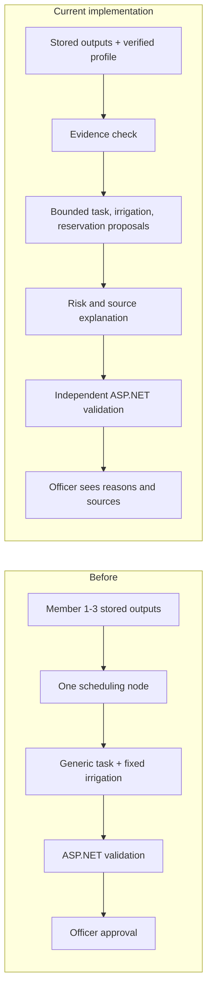
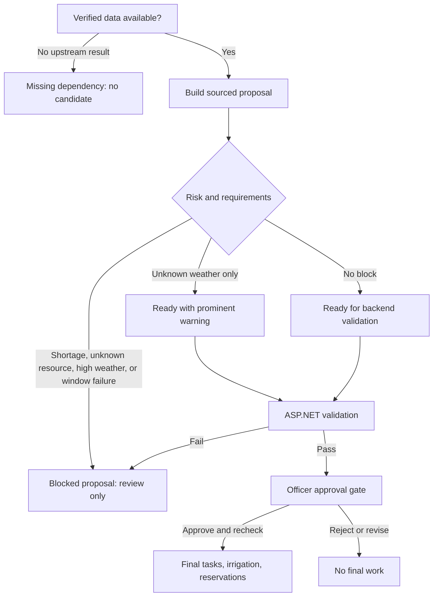

# Member 4 Agentic AI Improvement Report and Suggestions

**Date:** 2026-09-29
**Status:** Local implementation, disposable API-to-AI and officer-browser walkthrough, and PR CI verified
**Related design:** `docs/superpowers/specs/2026-09-29-member4-explainable-scheduling-design.md`
**Implementation plan:** `docs/plans/2026-09-29-member4-explainable-scheduling-implementation-plan.md`

## Baseline before this improvement

Member 4 owns the last step of crop planning: farm tasks, irrigation schedules, scheduling validation, officer approval, and final workflow integration. The current system already stores Member 1-3 outputs, asks `SchedulingValidationAgent` for a candidate, validates it in ASP.NET, and requires an Agricultural Officer or Admin to approve before any final task, irrigation schedule, or reservation is created. Approval rechecks mutable data in a transaction. React provides an officer review page and Flutter provides farmer status.

The baseline scheduler produced one generic task, one fixed 60-minute irrigation proposal, and no reservation proposals. It did not explain each item with a clear source. These observations describe the code before the version-2 changes in this branch, not a running deployment.

## The five things that matter most

| Priority | Recommendation | Why it matters | Evidence of success |
| --- | --- | --- | --- |
| 1 | Pin every proposal to the same workflow, revision, and verified crop profile. | Prevents a plausible-looking task from using another plan's crop stages or a different version of Member 3's requirements. | Stored source IDs and backend rejection of mismatched IDs. |
| 2 | Keep blocked proposals visible but never approvable. | Officers need to understand shortages or high weather risk without accidentally creating work. | Blocked status, reason, no Approve control, and zero final rows. |
| 3 | Generate crop-cycle and field-preparation tasks from structured evidence, inside the selected window. | This makes Member 4's scheduling agent a substantive contribution while avoiding invented agronomic instructions. | Multiple stage-linked tasks; an impossible stage duration produces a block. |
| 4 | Propose reservations only from Member 3's sufficient, comparable requirement and stock IDs. | Inventory is a mutable snapshot; amounts and units must not come from free text. | Exact quantity/stock match plus approval-time stock recheck. |
| 5 | Show a reason and source for each item in the existing officer page. | The human decision becomes understandable and demonstrable. | React tests and a manual officer review of task, irrigation, and reservation cards. |

## Local implementation evidence

The current branch builds a pinned profile and step evidence bundle, accepts validated Admin-authored irrigation rules, and routes the LangGraph scheduler through evidence, proposal, and risk nodes. It produces bounded source-linked preparation and crop-stage review tasks, rule-backed irrigation only when a rule exists, and Member 3-backed reservation candidates. A shortage or high weather risk returns a visible blocked candidate; otherwise valid reservations remain visible for officer review, and a shortage yields no reservation. Unknown weather is a warning. The backend stores status `12`, checks version-2 sources and evidence-derived explanations independently, and rechecks mutable data inside the existing approval transaction. React displays proposal reasons and sources, and Flutter explains the blocked state to farmers.

The original local suites passed on 2026-09-30: 86 AI-service tests, 195 backend tests including PostgreSQL-only cases, 93 React tests, and 42 Flutter tests. On 2026-10-01, review follow-up added server checks that tie displayed explanations to persisted evidence, retained valid resource proposals in non-shortage blocked reviews, and names every omitted stage when a crop cycle cannot fit. The updated full backend suite passed 196 tests against disposable PostgreSQL with no skips; the AI suite passed 86 tests. The prior browser walkthrough verified ready and blocked screens and the queue labels before these latest scheduler and validation changes. React passed 94 tests, and Flutter passed 42 tests. See `docs/testing/verification-log.md` for exact fixture and verification limits. A live weather-provider or LLM response remains unverified.

## Recommended delivery order

1. **Evidence foundation:** Add the typed crop-profile/stage handoff and a versioned scheduling contract. This is the dependency for every later improvement.
2. **Safer agent:** Generate preparation and crop-stage tasks, then source-linked resource reservations. Use `CandidateBlocked` for shortage/high weather/missing verified stage timing, and an unknown-weather warning.
3. **Irrigation accuracy:** Add an Admin-authored, verified irrigation schedule rule. Where no such rule exists, show “No verified irrigation schedule rule” and propose zero irrigation rather than a made-up duration.
4. **Officer explanation:** Add per-item reason/source cards and an obvious blocked notice to the existing React page. Keep raw JSON as audit evidence.
5. **Verification:** Prove the safe and blocked paths with Python, xUnit, React, Flutter, isolated PostgreSQL, and applicable CI jobs. Record exact results rather than calling planned checks “passed.”

## Suggestions after Option A

- **Next useful extension:** Add a small approval-readiness summary only after per-item reasons and sources are working. It should summarize existing validation rather than introduce another decision engine.
- **Later, if the assessment rubric requires each member to demonstrate an LLM call:** Add an optional evidence-bound prose summary. It must have no authority over dates, quantities, statuses, source IDs, or approval, and deterministic explanations must remain the fallback.
- **Defer:** Full revision comparison, new queue filters, notifications, and predictive irrigation. They add surface area without fixing the current scheduling evidence gap.

## Demonstration and report evidence

Prepare two disposable demonstration workflows. In the ready case, show a verified stage source, Member 2 preparation evidence, a sufficient Member 3 requirement, each proposal reason, the officer approval, and the final records created once. In the blocked case, show either a verified shortage or high weather risk, the displayed reason/source, the absent Approve action, and zero final records. Then show that changed weather or stock requires a **new upstream workflow run** before another candidate uses the new snapshot.

The final submission report should include the workflow and source IDs, crop profile source/version/verification date, screenshots of the officer proposal and blocked state, test commands with exit codes, PostgreSQL rollback/concurrency evidence, and CI job links. Separate deterministic fixtures from live weather or provider calls. Do not include API keys, bearer tokens, or production data.

## Completion boundary

The ready and blocked fixture paths were exercised through the browser, API, AI service, and isolated PostgreSQL database. Local frontend and Flutter checks finished, and the earlier PR head passed applicable CI jobs; CI must be checked again on any follow-up commit. The browser walkthrough stopped before an actual officer approval, while isolated PostgreSQL tests verified approval transactions, rollback, and concurrency. No fixture result is evidence of a live weather provider or LLM response.
