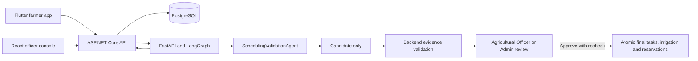

# SE3090 Group 04 - Consolidated report assembly draft

**Status (updated 2026-10-05):** Technical evidence draft for one eventual group PDF. Member 4 Phases 1-3 are merged in PRs #59 and #60. Optional verified-profile retrieval and Render preparation are merged in PR #67. Further Member 4 evidence-validation hardening is in PR #72; backend, AI-service, React, and Flutter CI passed on that PR head. Supabase-preserving Render and mobile configuration merged in PR #71; all four CI jobs passed there. On 2026-10-05, read-only HTTP checks returned 200 for the public React root, API health, API Swagger JSON, and AI health endpoint. These checks prove reachability only; they do not prove authenticated end-to-end workflow or live scheduling. Group 04 has not supplied a demonstration video or the remaining member-authored reports. This draft must not be submitted as the completed assignment. The other members must review their own work and supply their personal sections, AI logs, reflections, and signed declarations.

**Repository:** [Intelligent Pre-Cultivation Farm Planning and Management System](https://github.com/kaushalye1234/Intelligent-Pre-Cultivation-Farm-Planning-and-Management-System)

**Verified application baseline:** `dev` merge commit `46c50b4` from [Member 4 implementation PR #59](https://github.com/kaushalye1234/Intelligent-Pre-Cultivation-Farm-Planning-and-Management-System/pull/59). The Phase 3 evidence package was subsequently merged by [PR #60](https://github.com/kaushalye1234/Intelligent-Pre-Cultivation-Farm-Planning-and-Management-System/pull/60) at `0132934`.

## Group report - project and responsibilities

AgriAssist coordinates pre-cultivation farm planning through a shared ASP.NET Core 8 API, PostgreSQL, a React officer console, a Flutter farmer application, and an internal FastAPI/LangGraph AI service. The four assigned business areas are crop planning (Member 1), field inspections and crop issues (Member 2), resources and weather (Member 3), and scheduling, irrigation, approval, and workflow integration (Member 4). These ownership boundaries come from the repository's `AGENTS.md` and must be confirmed by each member before submission.

The application uses role-based access for Farmers, Field Officers, Resource Officers, Agricultural Officers, and Admins. React supports staff review and approval; Flutter supports the farmer journey and approved-work visibility. Both clients call the ASP.NET API. Only the backend calls the internal AI service and owns persistence and final business rules.

## Group report - architecture, data, and interfaces

The backend exposes authenticated REST endpoints, validates DTOs in validators, applies ownership and business rules in services, and uses EF Core 8 with PostgreSQL migrations. [The ER diagram](../database/er-diagram.md) shows the operational entities and workflow evidence. The AI workflow stores steps, tool executions, validation results, candidate revisions, and officer decisions. `GeneratedByWorkflowId` and `CandidateRevision` link approved tasks, schedules, and reservations to their source proposal. Final records are never created by the AI service directly.

The [OpenAPI v1 snapshot](../api/agriassist-openapi-v1.json) was exported from a local Testing-mode API on 2026-10-01. It documents 22 Member 4 `/api/task-approval/*` paths. The public Swagger JSON at <https://agriassist-api-sl97.onrender.com/swagger/v1/swagger.json> returned HTTP 200 on 2026-10-05. Core Member 4 operations include listing and reviewing workflows; generating a candidate; approving, rejecting, or requesting revision; managing tasks and irrigation schedules; and reading approval history. The source of truth remains the [controller](../../backend/AgriAssist.Api/Controllers/TaskApproval/TaskApprovalController.cs) and [workflow service](../../backend/AgriAssist.Api/Services/TaskApproval/WorkflowApprovalService.cs).

React's protected `/task-approval` queue and `/task-approval/workflows/:id` review screen show candidate tasks, irrigation, reservations, warnings, validation, explanations, source links, and appropriate decision controls. Flutter reads farmer-scoped workflow progress, approved tasks, irrigation schedules, and decision history through the same API. See the [Member 4 scheduling contract](../ai-usage/member-4-scheduling-approval-contract.md) for request and response semantics.

The group ADRs explain the [stack](../adr/0001-stack.md), [authentication and RBAC](../adr/0002-auth-rbac.md), [AI orchestration](../adr/0005-agentic-ai-framework-and-orchestration.md), [React state](../adr/0006-react-state-management.md), [Flutter state](../adr/0007-flutter-provider-state.md), [workflow storage](../adr/0008-workflow-state-database-strategy.md), and [deployment boundary](../adr/0009-deployment.md). Each owner should confirm those decisions still match the final deployed architecture.

## Group report - Agentic AI evaluation and safety

Member 4's `SchedulingValidationAgent` consumes persisted Member 1-3 outputs and a verified crop reference profile. It generates bounded preparation and crop-stage tasks, rule-backed irrigation, and Member 3-backed reservation proposals with an evidence source and explanation for each item. A missing verified irrigation rule yields zero irrigation proposals. A verified shortage or high weather risk yields a visible blocked candidate for officer review; unknown weather is surfaced as a warning. All proposed tasks stay within the farmer's selected scheduling window. Merged PR #67 adds one model-visible, empty-argument `GetVerifiedCropProfile` action that may retrieve crop context and a profile only through existing typed read-only GET wrappers; code validates provenance and data before the unchanged deterministic scheduler receives it. PR #72 further rejects conflicts with existing evidence and validates retrieved stages and irrigation rules. Complete evidence bypasses the model, invalid or missing evidence stays blocked, and approval remains a separate authorized officer action. The feature is disabled by default and has not had a live OpenAI run.

ASP.NET independently checks evidence IDs, timestamps, quantities, derived dates, and deterministic explanations. An Agricultural Officer or Admin must explicitly approve. The approval transaction rechecks mutable inventory and scheduling constraints, uses workflow version/revision and idempotency rules, and rolls back partial business writes on failure. Tests cover fabricated explanations, long irrigation rule keys, missing dependencies, blocked candidates, stale revisions, concurrency, and rollback. The [verification log](../testing/verification-log.md) identifies fixtures and actual run boundaries.

The recorded AI suite used deterministic inputs. The 2026-10-01 browser and API demonstrations used seeded upstream evidence. Neither is evidence of a live external LLM or weather-provider result. Group 04 must run and record a configured provider scenario before claiming provider-backed evaluation.

## Group report - testing and performance evidence

| Evidence | Recorded result | Scope |
| --- | --- | --- |
| Backend Release xUnit | 197 passed, 0 skipped | Disposable PostgreSQL; includes approval concurrency, rollback, and decimal quantities |
| AI service pytest | 86 passed | Deterministic fixtures |
| React Vitest | 94 passed | Officer queue and review components included |
| Flutter tests | 42 passed | CI on PR #59; Flutter analysis passed |
| GitHub Actions | Backend, AI service, React, Flutter passed | [PR #59](https://github.com/kaushalye1234/Intelligent-Pre-Cultivation-Farm-Planning-and-Management-System/pull/59) before application merge; [PR #60](https://github.com/kaushalye1234/Intelligent-Pre-Cultivation-Farm-Planning-and-Management-System/pull/60) documentation update checks also passed |
| Member 4 hardening CI | Backend, AI service, React, Flutter passed | [PR #72](https://github.com/kaushalye1234/Intelligent-Pre-Cultivation-Farm-Planning-and-Management-System/pull/72); includes pinned Python 3.12 AI environment |
| Deployment endpoint reachability | React, API `/health`, public Swagger JSON, AI `/health`: HTTP 200 | Read-only checks on 2026-10-05; no authenticated workflow or database readiness asserted |
| Android debug APK | Built in 286.8 s; installed and launched on emulator | `dev` commit `46c50b4`; login screen only, without backend sign-in |

The [performance report](../testing/performance-report.md) records one complete workflow fixture: coordinator 658.5 ms, field analysis 705.3 ms, weather/resource 63.9 ms, and scheduling 148.1 ms. Two ten-request local `/health` samples are also reported. These are smoke measurements with sample count one per workflow step, so no p50/p95, load capacity, or production SLA is claimed.

## Group report - deployment and Android artifact

The [startup guide](../../STARTUP.md) gives local PostgreSQL, AI service, backend, React, and Flutter commands and environment-variable names. Public endpoints returned HTTP 200 on 2026-10-05: [React](https://agriassist-react.onrender.com/), [API health](https://agriassist-api-sl97.onrender.com/health), [Swagger JSON](https://agriassist-api-sl97.onrender.com/swagger/v1/swagger.json), and [AI health](https://agriassist-ai-3boo.onrender.com/health). A retry was needed for AI health after a first timeout. These checks establish reachability only; this report does not independently verify Supabase-backed login, a complete approved workflow, or a live AI candidate. The Supabase-preserving Render and mobile update merged in [PR #71](https://github.com/kaushalye1234/Intelligent-Pre-Cultivation-Farm-Planning-and-Management-System/pull/71). Record database mode and an authenticated workflow result only after the group verifies them. The ten-minute demonstration video and personal member sections remain group deliverables.

A debug APK built from merged `dev` is saved locally at `output/apk/agriassist-member4-dev-46c50b4-debug.apk` (159,443,118 bytes; package `com.agriassist.mobile`, version `1.0.0`, min SDK 24, target SDK 36). SHA-256: `82E8AA8ADF533F9F901C8F988BBA2B66FDE95B7ABBEB5D88025B668E387E44C0`. Android `apksigner` verified one signer using APK Signature Scheme v2. `adb install -r` succeeded, and `com.agriassist.mobile/.MainActivity` stayed resumed on the `Medium_Phone_API_36.1` emulator. A screenshot of the unobstructed login screen is in the local `output/screenshots/member4-apk-login-2026-10-01.png`. Generated binaries and screenshots are excluded from the Git contribution. This is a debug build; Group 04 should decide whether its final evaluator APK needs a different signing and API URL configuration.

## Group report - security and references

JWT authentication and role authorization gate officer decisions; farmer-scoped reads keep other farms' records private. The Python service uses internal service tokens and allow-listed tools, while API keys, database credentials, and provider secrets stay in environment configuration. Approval checks data again inside the transaction because agent analysis is a snapshot. Source references: the SE3090 Assignment 1 specification supplied by Group 04, the [API contract](../ai-usage/member-4-scheduling-approval-contract.md), [ADRs](../adr/0005-agentic-ai-framework-and-orchestration.md), [verification log](../testing/verification-log.md), [performance report](../testing/performance-report.md), and [PR #59](https://github.com/kaushalye1234/Intelligent-Pre-Cultivation-Farm-Planning-and-Management-System/pull/59).

**Group AI usage declaration:** Each member must provide a dated individual AI log and personally confirm that the group declaration is accurate before it is signed. This draft does not assert that the other members' AI use has been fully disclosed.

## Individual report - Member 1 (owner-authored section required)

The Member 1 owner must add their crop-planning contribution statement, technical changes, commits/PRs/tests, challenges, dated AI log, personally written reflection, and signed declaration. Member 4 cannot author or attest to that personal section.

## Individual report - Member 2 (owner-authored section required)

The Member 2 owner must add their inspection and field-analysis contribution statement, technical changes, commits/PRs/tests, challenges, dated AI log, personally written reflection, and signed declaration.

## Individual report - Member 3 (owner-authored section required)

The Member 3 owner must add their resource and weather contribution statement, technical changes, commits/PRs/tests, challenges, dated AI log, personally written reflection, and signed declaration.

## Individual report - Member 4 technical evidence

**Component ownership:** Task and irrigation schedule operations, `SchedulingValidationAgent`, candidate validation, officer approval and revision workflow, and final integration. The [Member 4 plan](../plans/member-4-task-approval-integration-plan.md), [contract](../ai-usage/member-4-scheduling-approval-contract.md), and [PR #59](https://github.com/kaushalye1234/Intelligent-Pre-Cultivation-Farm-Planning-and-Management-System/pull/59) support this technical scope. The exact authorship of shared files must be confirmed from Git history, not inferred from path ownership. PR #60 adds the Phase 3 report evidence, toolchain inventory, and final-package documentation; it does not supply the group’s missing personal sections or deployment artifacts.

**Technical work:** The scheduling agent turns structured upstream evidence into sourced candidate tasks, optional verified-rule irrigation, and stock-backed reservation proposals. The backend checks sources and explanations, prevents premature final writes, and commits approved results atomically after revalidation. React makes candidate reasons and blocked status reviewable; Flutter exposes farmer progress and approved results. A three-decimal resource-quantity migration protects the reservation arithmetic.

**API and data evidence:** The Member 4 controller exposes 22 task-approval API paths in the checked-in OpenAPI snapshot. Representative operations include `GET /api/task-approval/workflows`, `GET /api/task-approval/workflows/{id}/history`, `POST /api/task-approval/workflows/{id}/generate-candidate`, and the officer-only `POST /api/task-approval/workflows/{id}/approve`, `/reject`, and `/request-revision` decisions. Task and irrigation-schedule search/detail/create/update/submit/cancel/delete routes and approval-history search are also provided. These operations support the business workflow beyond basic CRUD. PostgreSQL records include `FarmTask`, `IrrigationSchedule`, and `ApprovalDecision`; EF mappings, migrations, and the model snapshot are in the backend. The [controller](../../backend/AgriAssist.Api/Controllers/TaskApproval/TaskApprovalController.cs), [OpenAPI snapshot](../api/agriassist-openapi-v1.json), and [verification log](../testing/verification-log.md) provide the route and persistence evidence. The individual author must confirm which of these shared changes they personally made.

**Traceable evidence:** PR #59 merged at `46c50b4` after all four CI jobs passed. The full backend suite passed 197 tests against disposable PostgreSQL. The AI, React, and Flutter suites passed 86, 94, and 42 tests. The later debug APK build and emulator login-screen check are recorded in the verification log. Earlier Phase 3 acceptance evidence includes one successful and one conflicting concurrent approval request (HTTP 200/409) in a disposable environment.

**Individual Git ownership:** The student confirmed the `Kaushalye` Git author identity. Relevant Member 4 commits include `c4ea2ba` (scheduling approval workflow), `6dc27aa` (farmer workflow status), `522bcc8` (evidence-linked scheduling proposals), `14f7b41` (validation explanations bound to evidence), and `5f79910` (irrigation explanation limit). PR #59 contains the integrated implementation. Other members' commits and shared-file contributions are not attributed to Member 4.

**Challenges and decisions for Member 4 to explain in the viva:** The AI proposal is a snapshot, so approval must recheck inventory and date conflicts. Missing verified irrigation data must yield no invented schedule. High-risk weather and shortages should remain visible but unapprovable. Explanations are useful only if the backend binds them to persisted evidence; a long verified irrigation rule key exposed a 100-character contract mismatch that was fixed and regression-tested.

**Individual AI usage log:** Start with the [Member 4 AI usage log](../contributions/member-4-ai-usage-log.md), then reconcile this conversation and earlier tool use against the student's actual history. A verifiable entry from 2026-10-01 is Codex (GPT-6) assisting with a clean-worktree APK build, emulator launch check, Swagger export, and draft documentation; the recorded build result, checksum, screenshot, and source diff provide verification. Member 4 must add dates, models, outputs, changes/rejections, and checks for earlier AI-assisted work before signing the log.

**Personal reflection and signed declaration:** Member 4 must write these in their own words. The reflection should explain which AI tools were used, what they got right or wrong, what was changed or rejected, and what the student learned. No AI-generated personal reflection or signature is supplied here.

## Final assembly gate for the Group 04 leader

1. Obtain and review the four member-authored individual sections, dated AI logs, personal reflections, and signatures; add the group AI declaration.
2. Add actual React, API/health, Swagger, PostgreSQL, and video links, and verify them in a private browser. Add deployment and migration evidence.
3. Include a full ER diagram, diagrams, ADRs, screenshots, API/test evidence, and the runnable APK with installation instructions.
4. Render and inspect **one** consolidated PDF named with the `SE3090_G04` prefix, then submit that PDF, APK, repository and evaluator links through the required group channel. The current draft PDF is for review and assembly only.
