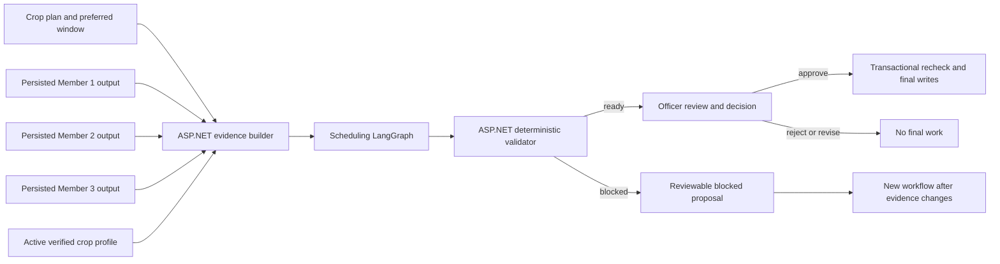
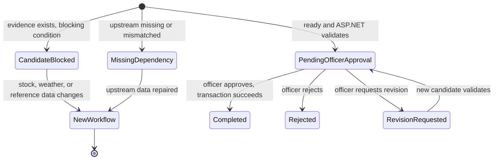

# Member 4 Explainable Scheduling Design

**Date:** 2026-09-29
**Status:** Implemented locally on `member4/explainable-scheduling`; disposable API-to-AI HTTP and draft PR CI passed; browser demo pending
**Owner:** Member 4
**Scope:** `SchedulingValidationAgent`, its ASP.NET handoff and validator, the existing officer review page, and farmer-facing blocked status.

## Purpose and decisions

The current scheduling step produces one generic task and a fixed 60-minute irrigation entry, while reservation proposals remain empty. The officer can inspect raw agent JSON but cannot see a concise reason and source beside each item. This design deepens Member 4's agent contribution while preserving the current human approval and transactional final-write boundary.

The decisions confirmed with the project owner are:

- Generate pre-planting and crop-cycle tasks only where validated Member 2 output and verified crop reference data support them.
- Keep every proposed date within the crop plan's preferred start/end window.
- Display a reviewable blocked proposal for a verified resource shortage; never make it approvable.
- Block high weather risk. Show unknown weather as a prominent warning, with approval possible when every other check passes.
- Show the reason and source beside each proposed task, irrigation entry, and reservation on the existing officer review page.
- Return zero irrigation entries when no verified irrigation rule exists. No duration or water need is invented.

This is one Member 4 feature, delivered in independently testable increments. It does not add a new queue, revision comparison, notifications, or an autonomous approval path.

## Architecture

`WorkflowApprovalService.BuildInputAsync` continues to load the persisted Member 1-3 step outputs. A focused ASP.NET evidence builder adds a typed, bounded crop-reference snapshot selected for the same plan. If Member 3 supplies `requirementSource.cropReferenceProfileId`, that profile ID pins the stage and irrigation evidence; a different profile is never silently mixed into one proposal. The profile must match crop type, compatible variety and region, be active and undeleted, and have `VerifiedAt <= now`. If Member 3 has no source, use the same variety/region/newest/ID ordering already used by `CropResourceRequirementService`; an unknown resource requirement still blocks approval. The evidence bundle records profile ID, version, verification time, stage IDs, rule IDs, and the current upstream step IDs.

The Python LangGraph path becomes three small nodes: **validate evidence**, **build bounded candidate**, and **assess risks and explain**. The agent exposes `check_dependencies(request)`, `propose(request)`, and `assess_risk(request, draft)` for those nodes; its existing `run(request)` composes the same operations for direct callers and tests. Conditional routing goes directly to `MissingDependency` when a persisted upstream step is absent or from another workflow. The agent uses deterministic functions for dates, quantities, conflicts, reasons, and source references. An LLM may later improve prose only behind strict structured-output validation; it cannot create, change, or remove tasks, dates, durations, quantities, risks, or sources. The initial implementation has deterministic explanations and does not depend on an LLM call.

## Proposal rules

1. **Inputs.** Require complete Member 1 (`Planned`), Member 2 (`Analyzed`), and Member 3 (`Analyzed`) outputs for the same workflow. Reject mismatched workflow IDs, invalid date ranges, and missing field IDs with `MissingDependency`, no candidates, and a safe reason.
2. **Preparation tasks.** Use the validated Member 2 `fieldPreparationRequirements` array as evidence. Each nonempty supported entry yields a bounded administrative task such as “Review recorded field preparation requirement”; the free-text entry is displayed as evidence, never interpreted as a command or an invented treatment. If no preparation requirement exists, no preparation task is invented.
3. **Crop-cycle tasks.** Sort the chosen verified profile's stages by `Sequence`, then ID. The first stage is planned after the preparation tasks on the first future day within the preferred window. A later stage's earliest date is the preceding stage date plus that preceding stage's `TypicalMinDays`. Missing duration for a stage that has a successor, duplicate sequence, or any stage that cannot fit in the window blocks the proposal. Titles are limited to review of the verified stage name; the agent does not infer specific cultivation treatments from the name or notes.
4. **Slots.** Start task slot search at 08:00 UTC on the derived stage or preparation date. Move by one hour only within that UTC date to avoid an active assignee-task conflict. Do not shift a verified stage to another date to hide an exhausted day; block and report the conflict. Persisted timestamps remain UTC; the UI converts for display.
5. **Irrigation.** An additive verified `CropRuleReference` with `RuleType = IrrigationSchedule` has `StructuredValueJson` of `{ "dayOffsetFromPlanting": 1, "startTimeUtc": "00:30", "durationMinutes": 60 }`. The Admin must provide these values and the existing source metadata. Validate offset as an integer from 0 to 365, `HH:mm` UTC time, duration from 1 to 1440 minutes, and unique rule keys/slots in one profile. A rule's date is the planting anchor plus its day offset. Shift the time by one hour only within that day to avoid overlapping irrigation; if it cannot fit inside the window, block. When there is no rule, propose no irrigation and explain that omission. No water volume is asserted.
6. **Reservations.** Use only Member 3 requirements with overall and per-item `Sufficient`, a positive `requiredQuantity`, a unique `resourceId`/unit match to `resourceChecks`, and one `inventoryStockId`. Use the Member 3 quantity (up to three decimal places), never an LLM estimate or free-text number. Duplicates, missing stock IDs, unit mismatches, `Incomplete`, `ResourceRequirementUnknown`, `InventoryNotComparable`, or `Insufficient` block approval. A shortage still returns any safely derived tasks as a reviewable blocked proposal; it creates no reservation record.
7. **Cost.** `estimatedUnitCost` and `estimatedCost` remain `null` until a separate authoritative price contract exists. Unknown cost is a warning, never zero.
8. **Weather.** `High` produces a blocking constraint. `Unknown` produces a prominent warning but does not alone block. `Low` and `Medium` are recorded with their persisted source. Weather is a snapshot; it is not presented as a live forecast.

The task count remains 1-50 for a ready proposal, irrigation 0-20, and reservations 0-50. A blocked proposal may have fewer items, including none. A proposal with no verified stage tasks cannot become ready. If a verified crop cycle cannot fit inside the preferred window, the blocked result lists the unscheduled stage IDs and reasons; it never extends the dates.

## Contracts and state

Add `contractVersion = 2` and `evidence` to `SchedulingValidationInput` and `SchedulingValidationOutput`, aligned in ASP.NET records and Pydantic aliases. Add `reason` and `sources` to each candidate task, irrigation entry, and reservation. Each source uses a typed `kind` (`FieldAnalysis`, `CropStage`, `IrrigationRule`, or `ResourceRequirement`), stable source ID, display label, and, for crop-reference sources, profile ID/version/verified time. Bind sources to the exact input evidence; a plausible-looking ID alone is insufficient. Require 1-4 sources per proposed item, a reason of 1-500 characters, and a source label of 1-180 characters. Keep source URLs optional and display only valid `http`/`https` links.

Output statuses are `CandidateReady`, `CandidateBlocked`, `MissingDependency`, and the existing safe failure behavior. A new `AgentWorkflowStatus.CandidateBlocked = 12` distinguishes blocked evidence from transport or agent failure. A blocked result stores its output and failed validation record, sets `requiresHumanApproval = false`, and never enters `PendingOfficerApproval`. Only `CandidateReady` with a complete deterministic validation may enter officer approval. Older stored proposals without `contractVersion` continue through the existing validator rules so a deployment does not silently strand an already pending decision; new version-2 proposals require source validation.

The current `StartAiWorkflowAsync` permits a new workflow on the same nonterminal crop plan after a blocked workflow because it rejects only existing `Pending` or `Running` workflows. The officer page should explain that a changed stock/weather/reference snapshot requires a **new upstream workflow run** before generating another candidate; regenerating the same blocked workflow would reuse old Member 3 data. No new cross-member reanalysis endpoint is in scope.

## Validation and final-write boundary

ASP.NET independently checks profile and step provenance, stage ordering and derived dates, rule values, candidate counts, role/ownership, current schedule conflicts, inventory identity/unit/quantity, and weather/resource block rules. It must not trust the Python status, explanation, or claimed source metadata to grant approval. `WorkflowApprovalService` persists validation errors and warnings for officer review. A version-2 ready candidate with zero irrigation is valid when no irrigation rule exists; a candidate that omits irrigation despite an applicable verified rule is invalid.

Approval still requires AgriculturalOfficer (`4`) or Admin (`5`), current candidate revision, expected workflow version, and idempotency key. Inside the existing database transaction, revalidate mutable scheduling and stock constraints and verify the pinned profile remains active and unchanged. Only then create final farm tasks, irrigation schedules, reservations, plan history, decision, and completed workflow state. Rejection and revision create no final work. Existing audit, soft-delete, rollback, and concurrency behavior remain intact. A PostgreSQL integration run, not EF InMemory alone, is required to support transaction and concurrent-approval claims.

## Officer and farmer experience

The existing React `WorkflowReviewPage` renders a concise proposal section ahead of raw agent evidence. Each task, irrigation entry, and reservation has its UTC-to-display date/quantity, reason, and source. Blocking reasons and warnings are visually separate; `Approve Workflow` is absent for `CandidateBlocked`. The raw stored output remains available for audit. Existing decision, revision, and validation sections remain. The Task Approval queue and Crop Planning list also label status `12` clearly. Flutter needs only a safe label/tone/message for status `12`; no farmer approval control is added.

## Verification and acceptance

- Python tests cover missing/mismatched upstream, deterministic stage ordering, preparation evidence, same-day conflict search, exhausted windows, weather High/Unknown, unknown or duplicate resources, stock mapping, zero irrigation, rule-driven irrigation, and hostile text that must not become an instruction.
- Backend tests cover profile selection and drift, version-2 source validation, zero irrigation, blocked persistence, no final writes, stale revision, rejection, revision, rollback, and duplicate/concurrent approval attempts. Use isolated PostgreSQL for migration, stock concurrency, and transaction claims.
- React tests cover per-item reason/source, safe URL rendering, blocked approval removal, warning display, and older output fallback. Flutter tests cover blocked label/tone/message. Run all applicable backend, AI-service, React, Flutter, and CI checks from `AGENTS.md`.
- End-to-end acceptance uses one ready and one blocked workflow. Record source IDs/profile version, proposed items, officer decision, final-row counts, and evidence of no final rows before approval. Never claim a live weather/LLM result from a fixture or an EF InMemory transaction test.

## Out of scope and coordination

Do not modify Member 1-3 agent behavior or silently change their persisted contracts. The additive irrigation rule uses the shared crop reference validator; coordinate that shared-file change with Member 1 during implementation. The Member 3 resource requirement rules and stock calculation remain owned by Member 3. The enum value and JSON contract require no schema change. Implementation uncovered a separate precision mismatch: Member 3 calculates three-decimal requirements while the inventory ledger stored two decimals. `Member4ResourceQuantityPrecision` widens inventory, reservation, and ledger quantity columns to `numeric(13,3)` with matching EF mappings and snapshot; the isolated PostgreSQL test verifies exact persistence.
